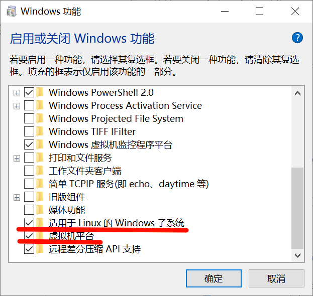
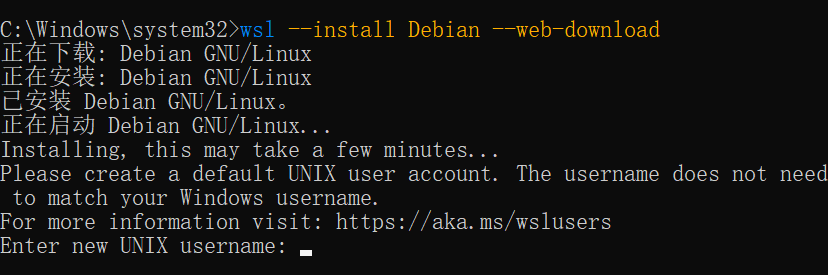
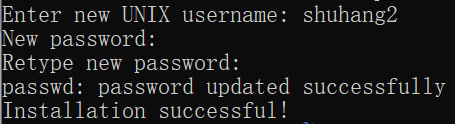
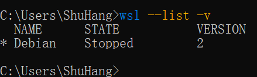
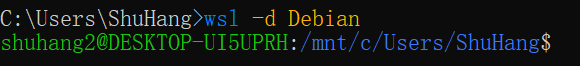

# WSL

## Linux子系统安装

在windows中启用**适用于Linux的Windows子系统**、**虚拟机平台**

使用管理员运行CMD，输入`wsl --install Debian --web-download`，下载Debian系统

Ps：也可以使用`wsl --list -online`，查看所有可以安装的Linux系统

输入用户名、密码

## 启动停止Linux子系统

查看Linux子系统：`wsl --list -v`

设置默认子系统：`wsl --set-default Debian`

启动Linux子系统：`wsl -d Debian`

删除Linux子系统：`wsl --unregister Debian`