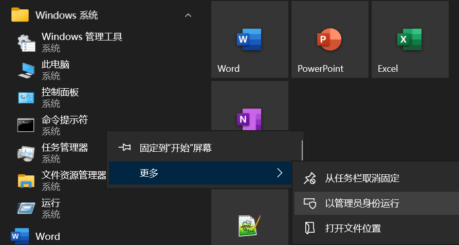

# 双系统下完全卸载ubuntu

双系统安装完成之后开机会看到如下界面：
ubuntu                         启动ubuntu系统
ubuntu高级选项                  开发者模式（配置ubuntu的启动项以及ubuntu系统修复等）
windows boot manager           启动windows系统
system setup                   bios设置

如果ubuntu出现问题我们可以尝试进入，ubuntu高级选项，进行修复

但是某些原因我们需要完全卸载ubuntu系统则需要回到windows系统进行操作

## 完全删除ubuntu

步骤一：右键‘我的电脑’ 选择管理，点击磁盘管理

步骤二：确定ubuntu系统存放的位置，在WIN下进行删除分区（一定要将所有ubuntu分区删掉）

步骤三：搜索：CMD（或者搜索：命令行）并用管理员身份打开，或者在开始菜单找到windows系统文件夹，找到命令提示符，选择管理员打开



步骤四：输入：
```
diskpart
list disk
```

步骤五：确的定windows的EFI分区（也就是c盘所在分区）
我的是在磁盘0,输入：
```
select disk 0
list partition
```

步骤六：确定分区，类型是系统（我的是在分区1）,并且分配可见盘符输入：
```
select partition 1
assign letter=H（可以看到出现F盘，但是没有权限访问）
```
注意：如果F不可用可以换成其他的，比如H

步骤七：授权访问F盘
1. 搜索记事本，并用管理员权限打开
2. 点击文件 -> 打开 -> 进入F盘
3. 可以看见EFI文件夹，进入里面删掉ubuntu这个文件夹（里面内容无法访问但是可以直接删除）

这里的记事本也可以是使用其他的，比如notepad++等，只要可以使用管理员打开目录就可以

步骤八：关闭F盘，输入：

```
remove letter=H
```

ubuntu已经完整的删除了


